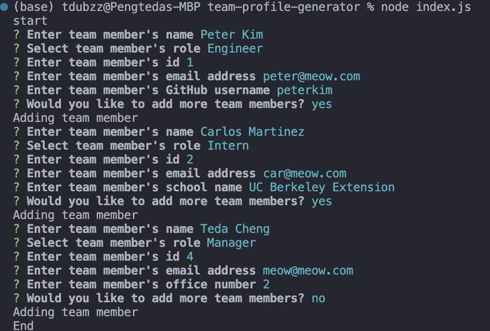

# Team Profile Generator 

## Description 
A command line application using Node that dynamically generates a team-displaying HTML file for a user based on their responses to inputs. 

## Installation 
Run node.js from the command line and perform an npm install in order to download all necessary modules. The application is initiated with the CLI command "run index.js."

## Demo

[Demo Video](https://youtu.be/Vi0PhONcAf4)

## Languages and Tools Used 
* 
* 
* 
* Inquirer

## Credits
Pengteda Cheng 
* 
* 
* [Markdown Badges](https://github.com/Ileriayo/markdown-badges)